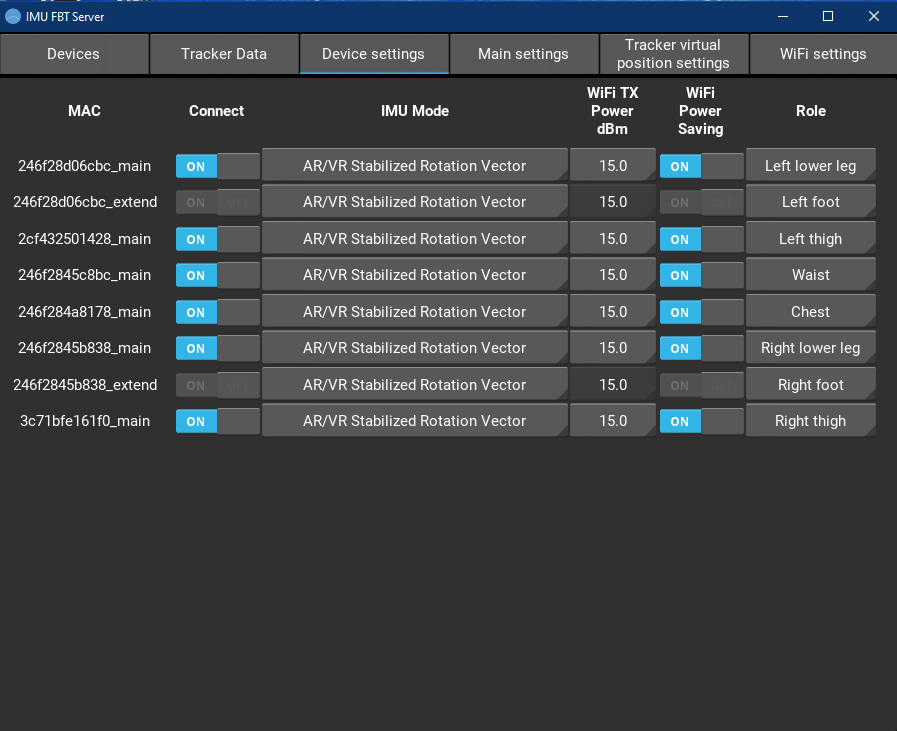
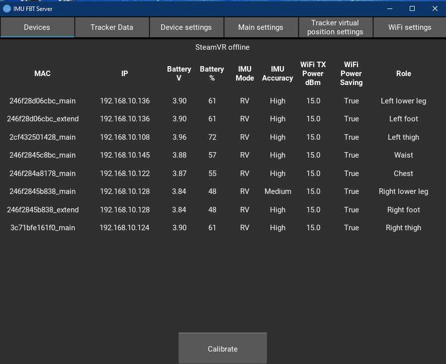

# IMU-VR-Full-Body-Tracker
 Inside-out full body tracker for Steam VR based on ESP32 with BNO085 IMU.  
 No base station is required, completely wireless.  
 Compatible with any VR headset that supports Steam VR.  
 Requires 5 sets of ESP32 + BNO085 to track waist, thigh and leg to complete 6 point full body tracking in Steam VR.
 
## Installation
 Extract steamvr.driver.zip and copy imuFBT folder to <Steam directory>\steamapps\common\SteamVR\drivers  
 
## Usage
 1. Extract esp32.sketch.zip, edit WiFi SSID and password, and others settings if necessary in esp32_settings.h file.  
 2. Upload the skecth to ESP32 microcontroller with Arduino IDE (SparkFun_BNO080_Arduino_Library Arduino library is required).  
 3. Extract desktop.server.zip and run imufbtserver.exe (might trigger antivirus false positive, typical problem for unsigned exe files).  
 4. Set the sensor frame to driver frame (X right, Y up, Z back) XYZ intrinsic rotation based on the mounting orientation, and body parts measurement and sensor position settings in **Settings** tab.  
   
 5. Switch on the trackers.  
 6. The trackers will be listed in both **Devices** and **Role assignment** tabs.  
 7. Set the roles of the trackers in **Role assignment**.  
   
 8. Once everything is setup properly, the trackers with correct roles assignment will be shown in **Devices** tab.  
   
 9. Open SteamVR.  
 10. The trackers will be shown in SteamVR environment at weird position and orientation on startup.  
   
 11. Stand straight and look forward, then reset SteamVR view to realign/calibrate the trackers.  
   
 12. Done!  
 
 
 
 